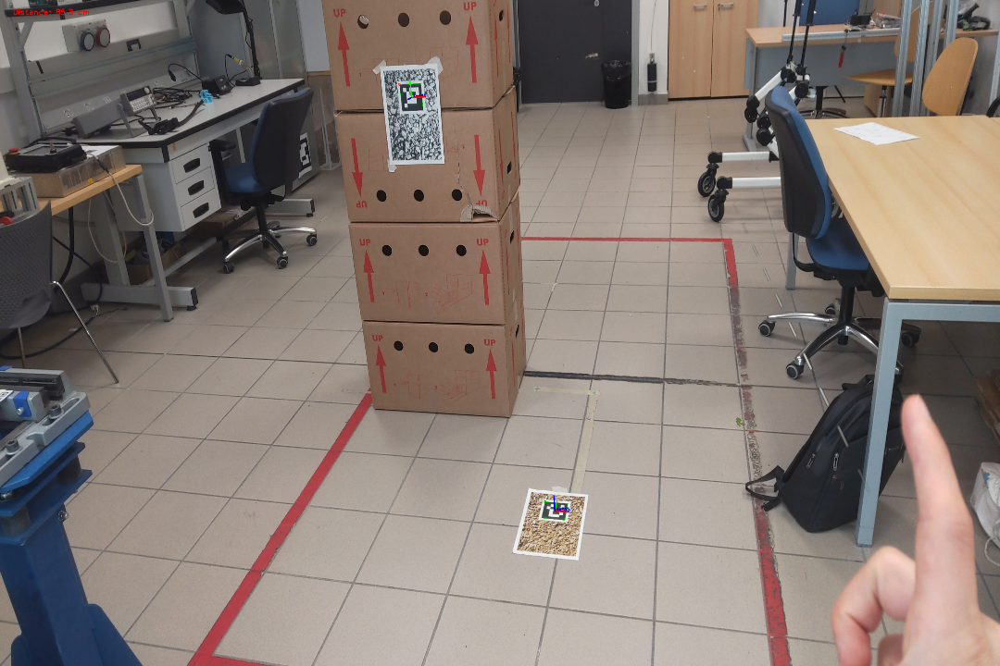

# ARUCO POSE ESTIMATION
This folder contain all the useful code to perform an aruco pose estimation
is principally based on the OpenCV official guide for [Aruco detection](https://docs.opencv.org/4.7.0/d5/dae/tutorial_aruco_detection.html)\

It tries to find the pose of at least two aruco markers ids specified by the user and 
find the relative position and rotation with respect to a given marker id


## How to use:
- Import in the folder _"calib_data/"_ the calibration _data.json_ file computed following the [Calibration instruction](../Calibration/README.md)
- Run the code with the following command:
    
    | Argument        | Description                                              | Required | Default |
    |-----------------|----------------------------------------------------------|----------|---------|
    | `--calib-path`  | Calibration path file  e.g. _"calib_data/data.json"_     | `True`   |         |
    | `--marker-size` | The marker size in cm                                    | `False`  | `5`     |
    | `--img-path`    | The image path to which perform the aruco pose etimation | `True`   |         |
    | `--from-id`     | The id of the first marker to detect                     | `False`  | `12`    |
    | `--to-id`       | The id of the second marker to detect                    | `False`  | `0`     |
    
    E.g. you can run the code with the following command:
    ```bash
    python ArucoPoseEstimation/main.py --marker-size 5 --calib-path calib_data/data.npz  --img-path opencv_frame_0.png --from-id 12 --to-id 0
    ```
  

- The code will calculate the distance of the two markers and will save the relative translation and rotation vectors into _"output/"_ directory as a _json_ file


    