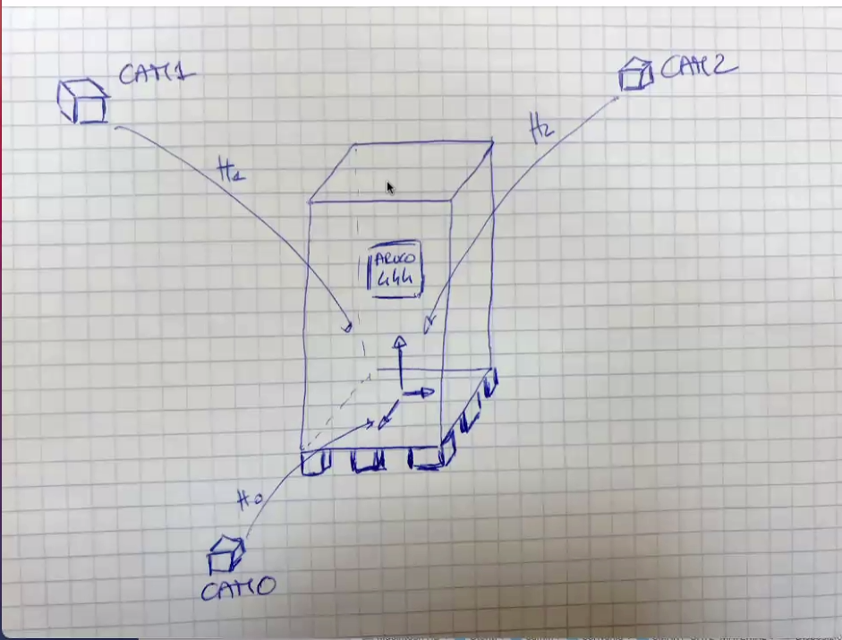

# POINT CLOUD
This folder contains all the useful python code to manage point cloud. 
Is principally based on the package [Open3D package](http://www.open3d.org/docs/release/index.html).\
Summarizing what the code does:
- Load the point clouds and the images from a given dataset of point clouds each one composed of three point clouds from
3 tof camera placed in a triangular shape

  
- Equalize the image
- Perform a downsampling process
- Make a single combined point cloud through the transformation matrices of the cameras
- Remove statistical outliers
- Remove planes such ground and walls
- Perform a clustering leading to the final pallet point cloud 


## How to use

To run the code move the terminal in _SmartGate/PointCloud_ with _cd_ command. \
The _main.py_ file accept the following parameters.

| Argument    | Description                             | Options    | Required | Default |
|-------------|-----------------------------------------|------------|----------|---------|
| `--dataset` | Dataset selection                       | `1` or `2` | `True`   |         |
| `-p`        | If specified it will show all the plots |            | `False`  | `False` |

e.g. In order to select the dataset 1 and showing all the plots run the following code:
```bash
python main.py --dataset 1 -p
```

## Importing in unity
After having imported the ply file in Unity, the following changes of coordinate are needed, in order to make the center
of the aruco as the origin of the coordinate system of the pallet:
- Translation from OpenCV to Unity:
  - x &rarr; y
  - y &rarr; z
  - z &rarr; -x
- Rotation from OpenCV to Unity:
    - x &rarr; +90
    - y &rarr; 0
    - z &rarr; 90
